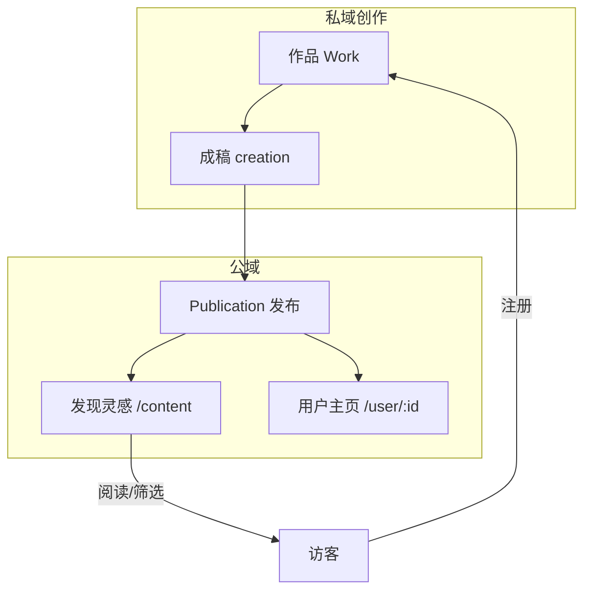

# 内容与社区生态

有感不仅是个人创作工具，还通过**公开发布**与**发现灵感**构建轻量内容生态，服务获客、留存与作者品牌。

## 生态结构

---

## 发布物（Publication）

### 业务定义

用户将 Studio 中某件作品的成稿发布为有感平台上的可读内容，可关联 `workId`，保留创作溯源。

### 生命周期

| 状态 | 含义 | 用户操作 |
|------|------|----------|
| `draft` | 草稿已保存 | 可继续编辑、正式发布 |
| `published` | 公开展示 | 出现在发现页与作者主页 |
| `archived` | 已归档 | 下线公开展示 |

### 内容元数据（支持发现与运营）

发布时可携带（来自作品 profile / 成稿，**AI 推断 + 用户确认**）：

| 维度 | 字段 | 用途 |
|------|------|------|
| 目标平台 | `platform` | 小红书、公众号、有感等 |
| 内容体裁 | `contentFormat` | 笔记/长文/小说/播客等 |
| 主题类别 | `topicCategory` | 生活方式/故事/干货等 |
| 媒介形态 | `mediaType` | 纯文字/图文/音频/视频/混合 |
| 原始选题 | `contentTopic`、`contentType` | 推断来源、搜索与展示 |
| 标签 | `hashtags` | 话题传播 |
| 封面与配图 | `coverUrl`、`images` | 列表展示 |

taxonomy 定义于 `packages/domain/src/models/taxonomy/`，API/前端同步于 `apps/web/src/lib/discover-taxonomy.ts`。

**完整分类设计文档**：[content-taxonomy.md](./content-taxonomy.md)

### 分类策略（两层维度）

- **媒介形态**（`mediaType`）：text / image / audio / video / mixed — 决定渲染方式
- **内容体裁**（`contentFormat`）：note / article / novel / podcast 等 — 决定发现页筛选

创作阶段不暴露完整 taxonomy；发布时通过确认弹窗展示 AI 推断标签，用户可修改后发布。

### 发布流程（用户视角）

1. 创作模式生成 `creation.body`。
2. Studio 点击「发布到有感」→ **发布确认弹窗**。
3. 系统展示 AI 推断的分类标签（体裁 / 主题 / 媒介 / 平台），用户可修改。
4. 确认后创建或更新 `Publication` 并发布。
5. 已发布作品显示「在发现灵感查看」链接 → `/content/:slug`。

---

## 发现灵感（公域流量）

### 产品定位（文案）

> 浏览创作者公开分享的图文，找选题参考，看看不同平台的内容怎么写。

### 页面能力

- 路径：`/content`
- **消费意图快捷入口**（读故事 / 看干货 / 刷笔记 / 听内容 / 看视频）
- 精选推荐 + 更多列表
- 多维度筛选（平台、体裁、主题、媒介）
- 空状态与筛选无结果提示

### 商业价值

| 价值 | 说明 |
|------|------|
| 获客 | SEO/分享链接带来访客，降低 CAC |
| 激活 | 看到真实案例后注册尝试 Studio |
| 网络效应 | 发布越多 → 发现越丰富 → 吸引更多创作者 |
| 数据 | 阅读 `viewCount`、发布趋势可支撑运营决策 |

### 缓存策略

发现列表与详情支持 Redis 缓存（`REDIS_URL` 配置时），提升公域页性能，利于流量放大。

---

## 个人主页与作者品牌

### 公开主页 `/user/:userId`

展示：

- 头像、封面、简介
- 已发布内容列表
- 统计：已发布篇数、总阅读量、近 6 月发布趋势

### 自己的主页 `/profile`

与公开页类似，增加「编辑资料」入口。

### 商业价值

- 创作者可把主页作为**作品集**对外展示。
- 为后续「关注」「付费专栏」等社交/变现能力预留载体（当前代码未实现关注关系）。

---

## 内容与会员的关系

| 能力 | 免费版 | Pro |
|------|--------|-----|
| 发布到有感 | 可用 | 可用 |
| 发现页阅读 | 所有人 | 所有人 |
| 第三方平台发布 | — | 套餐文案包含 |

公域发布不单独收费，利于生态冷启动；变现主要靠 **AI 额度订阅**。

---

## 商业计划书：生态飞轮叙述

1. **创作者**在 Studio 完成三步并发布优质公开内容。
2. **访客**在发现灵感浏览、筛选，获得选题参考。
3. 访客**注册**成为创作者，继续发布，丰富公域。
4. 高频用户**升级 Pro**，获得更高 AI 额度与平台直连发布。

可量化的生态指标：公开发布率、发现页 PV/UV、.slug 分享转化、人均阅读量。

---

## 合规与内容治理（规划建议）

当前代码侧重发布与展示，商业计划宜补充（待产品建设）：

- 内容审核机制
- 侵权与抄袭投诉
- 公开内容下架与账号处罚流程
