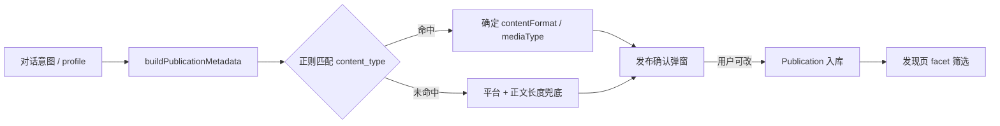

# 内容分类体系（Content Taxonomy）

有感的内容分类采用 **两层正交维度**，分别服务创作推断、发布确认与发现页筛选。

## 设计原则

| 阶段 | 用户是否感知分类 | 平台行为 |
|------|------------------|----------|
| 创作（灵感→大纲→创作） | **不暴露**完整 taxonomy | AI 根据对话意图隐式写入 `Work.profile` |
| 发布 | **轻量确认** | 展示 AI 推断标签，用户可修改后发布 |
| 发现（消费） | **结构化筛选** | 使用稳定枚举字段驱动筛选与展示 |

核心思路：**创作时意图驱动，发布时确认标签，消费时结构化过滤。**

---

## 两层分类维度

### 1. 媒介形态（`mediaType`）

描述内容的**呈现载体**，决定未来渲染组件（阅读器 / 播放器 / 图库等）。

| ID | 标签 | 说明 |
|----|------|------|
| `text` | 纯文字 | 无配图 |
| `image` | 图文 | 以图片为主或短图文 |
| `audio` | 音频 | 播客、音乐、语音 |
| `video` | 视频 | 短视频、口播 |
| `mixed` | 混合 | 长文 + 配图 |

### 2. 内容体裁（`contentFormat`）

描述内容的**写作/叙事形式**，用于发现页「我想看什么类型」。

| ID | 标签 | 说明 |
|----|------|------|
| `note` | 图文笔记 | 小红书风格种草笔记 |
| `short_post` | 短帖动态 | 微博式短内容 |
| `article` | 长文深度 | 公众号式长文 |
| `blog` | 博客专栏 | 技术/观点专栏 |
| `novel` | 小说故事 | fiction、连载 |
| `video_script` | 视频脚本 | 口播稿、分镜文案 |
| `short_video` | 短视频 | 短视频成品（规划） |
| `podcast` | 播客 | 音频节目（规划） |
| `music` | 音乐音频 | BGM、歌曲（规划） |

### 3. 主题类别（`topicCategory`）

| ID | 标签 |
|----|------|
| `life` | 生活方式 |
| `career` | 职场成长 |
| `tech` | 科技数码 |
| `culture` | 人文艺术 |
| `story` | 故事叙事 |
| `knowledge` | 知识干货 |
| `brand` | 品牌营销 |
| `general` | 综合 |

### 4. 目标平台（`platform`）

创作时的分发目标，同时参与体裁推断兜底。

`yougan` · `xiaohongshu` · `weibo` · `wechat` · `douyin` · `kuaishou` · `bilibili`

---

## 分类推断流程

### 推断优先级

1. **`profile.content_type`** 自由文本 → 正则映射到 `contentFormat` / `mediaType`
2. **`profile.content_topic`** → 正则映射到 `topicCategory`
3. **平台 + 正文长度 + 是否有配图** → 兜底推断
4. **发布时用户覆盖** → `applyMetadataOverrides` 校验 catalog ID 后写入

### 代码位置

| 模块 | 路径 |
|------|------|
| Taxonomy 定义与推断 | `apps/api/src/lib/discover-taxonomy.ts` |
| Agent 内容规格与路由 | `apps/agent/src/lib/content-spec.ts` |
| 创作子图 | `apps/agent/src/agents/creation/graph.ts` |
| 体裁写作约束 | `apps/agent/src/agents/creation/format-prompts.ts` |
| 前端 catalog 同步 | `apps/web/src/lib/discover-taxonomy.ts` |
| 发布入库 | `apps/api/src/services/publications.ts` |
| 预览 API | `GET /api/publications/preview-metadata?workId=` |
| 发布 API | `POST /api/publications`（可选 `metadata` 覆盖） |

---

## 发布确认（Publish Confirm）

### 用户流程

1. 创作模式生成 `creation.body`
2. 点击「发布到有感」→ 打开确认弹窗
3. 系统调用 `preview-metadata` 展示 AI 推断标签
4. 用户可在下拉框中修改：体裁 / 主题 / 媒介 / 平台
5. 确认后携带 `metadata` 覆盖项发布

### 为什么只在发布时暴露

- 创作过程中体裁可能变化（先写博客后改短帖）
- 发布是对外承诺的时刻，此时确认标签成本最低
- C 端用户心智是「我要发布了」，不是「我要填 metadata」

---

## 发现页消费意图

发现页（`/content`）提供两层入口：

### 消费意图快捷入口

| 入口 | 筛选条件 |
|------|----------|
| 读故事 | `topicCategory=story` |
| 看干货 | `topicCategory=knowledge` |
| 刷笔记 | `contentFormat=note` |
| 听内容 | `mediaType=audio` |
| 看视频 | `mediaType=video` |

### 详细筛选面板

平台形态 · 内容体裁 · 主题类别 · 媒介形态（四维 facet，仅展示有内容的选项）

---

## 创作侧 profile 字段

AI 在对话中隐式维护的 `Work.profile` 字段：

| 字段 | 用途 |
|------|------|
| `content_type` | 自由文本，自然语言类型描述 |
| `content_format` | 结构化体裁（与 `contentFormat` 对齐） |
| `media_modality` | 结构化媒介形式（与 `mediaType` 对齐） |
| `content_topic` | 自由文本，推断 `topicCategory` |
| `platform` | 目标平台 |

这些字段在 Studio 的「内容设置」面板只读展示，不要求用户手动填写。

### Agent 写入时机

| 阶段 | 工具 | 行为 |
|------|------|------|
| 灵感 | `confirm_content_spec` | 用户明确体裁/形式时写入 |
| 大纲 | `confirm_content_spec` / `update_work_profile` | 补充或修正规格 |
| 创作入口 | `resolveContentSpec` 节点 | 自动补齐缺失字段 |
| 创作执行 | `generate_content` | 按体裁/形式约束出稿 |
| 发布 | 发布确认弹窗 | 用户可覆盖最终分类 |

---

## 扩展规划

| 能力 | 当前状态 | 下一步 |
|------|----------|--------|
| 文本文案生成 | ✅ 已实现 | — |
| 配图 | 部分（Publication 支持 images） | 生成工具写入 images |
| 音频/视频 | taxonomy 已预留 | 增加生成 pipeline + 渲染组件 |
| 外部平台一键发布 | OAuth 脚手架 | 与发布流程打通 |

当音频/视频生成能力上线后，`mediaType=audio|video` 的推断将不仅依赖 `content_type` 关键词，还会检测成稿中的媒体附件。
