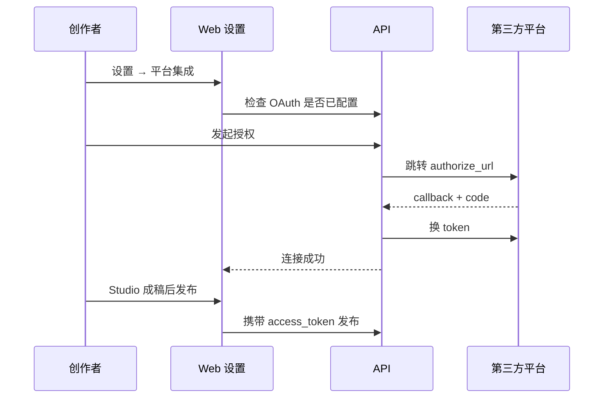

# 平台集成与分发

## 业务目标

减少创作者在「有感写完 → 各平台后台粘贴发布」之间的摩擦，通过 OAuth 绑定账号后，**从有感直接发布**到主流自媒体平台。

产品文案：

> 绑定账号后，在有感生成的内容可直接发到小红书、公众号等平台，少一道复制粘贴。

---

## 支持平台

与 `PUBLISH_PLATFORMS` 一致：

| 平台 ID | 显示名 | 业务描述（代码） |
|---------|--------|------------------|
| xiaohongshu | 小红书 | 一键发布到小红书笔记 |
| weibo | 微博 | 同步发布到微博 |
| wechat | 微信公众号 | 推送到公众号草稿或发表 |
| douyin | 抖音 | 短视频或图文发布 |
| kuaishou | 快手 | 短视频或图文发布 |
| bilibili | 哔哩哔哩 | 视频或动态发布 |

营销页与能力页统一展示上述六平台，强化「多平台内容形态」认知。

---

## 用户旅程

### 用户侧步骤

1. 进入 `/settings/integrations`。
2. 查看各平台 OAuth 配置状态（运营是否在 API `.env` 配齐变量）。
3. 对已配置平台点击连接 → 平台授权页 → 回调成功提示。
4. 在创作台完成成稿后，使用平台发布动作（与「发布到有感」并列的产品能力）。

### 运营侧前置条件

- 在各平台开放平台注册应用。
- 配置回调 URL：`{PUBLIC_BASE_URL}/api/integrations/oauth/callback`
- 配置环境变量：`{PLATFORM}_OAUTH_CLIENT_ID` 等（详见 [platform-oauth.md](../platform-oauth.md)）。

---

## 数据模型：`PlatformIntegration`

每个用户每个平台一条记录：

| 字段 | 用途 |
|------|------|
| platform | 平台 ID |
| accountName / accountId | 展示已绑定账号 |
| accessToken / refreshToken | 调用发布 API |
| tokenExpiresAt | 刷新策略 |
| scopes | 授权范围 |
| status | connected 等 |
| metadata | 扩展信息 |

---

## 与会员套餐的关系

- **Pro 套餐功能列表**包含「平台集成发布」。
- 免费版用户完成 OAuth 的技术能力可能存在，但商业上应以 Pro 作为付费理由（需在 GTM 与产品门禁上保持一致，当前以文案与运营策略为主）。

---

## 商业价值分析

| 价值 | 说明 |
|------|------|
| 提高 Pro 转化 | 发布是高频刚需，直连平台减少工具切换 |
| 提高留存 | 账号绑定增加迁移成本 |
| 差异化 | 纯写作 AI 少有完整 OAuth + 多平台 |
| 数据潜力 | 可统计各平台发布成功率、偏好平台 |

---

## 风险与依赖

| 风险 | 缓解 |
|------|------|
| 各平台 API 政策变化 | 抽象发布适配层；快速下线单平台 |
| OAuth 审核与配额 | 分平台逐步上线，设置页展示配置状态 |
| 内容合规 | 发布前审核（规划）；用户协议免责 |
| 运维成本 | 仅 Pro 开放；六平台不必同时上线 |

---

## 与「发布到有感」的关系

| 渠道 | 是否需要 OAuth | 作用 |
|------|----------------|------|
| 发布到有感 | 否 | 公域曝光、发现页、主页作品集 |
| 第三方平台 | 是 | 触达粉丝、平台算法分发 |

两者互补：**有感**做创作与选题社区，**外部平台**做流量变现主阵地。

---

## 商业计划书表述建议

> 有感 Pro 会员可绑定小红书、微博、公众号等六大平台账号，在 Studio 完成三步创作后一键分发，将 AI 辅助写作的价值从「生成文本」延伸到「送达读者」，提升 ARPU 与粘性。平台接入按 OAuth 标准协议实现，可分阶段上线以降低合规与研发风险。
