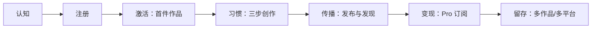
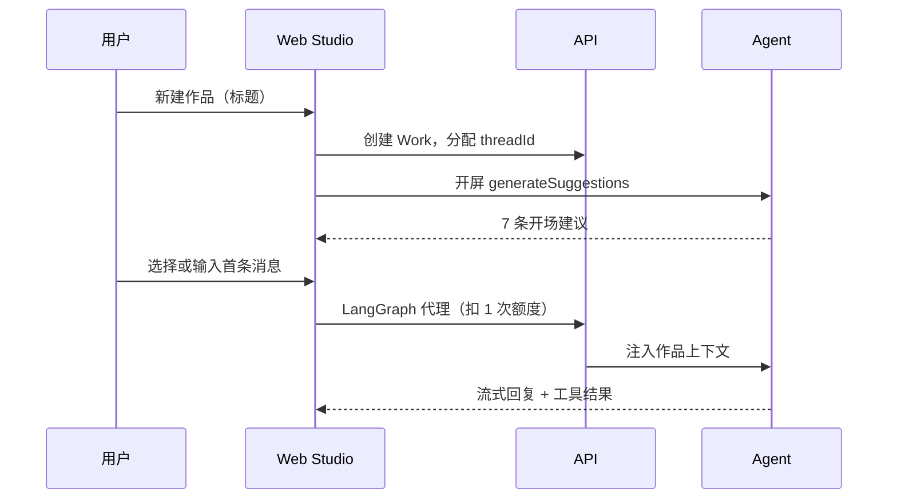

# 用户旅程

## 旅程总览

---

## 1. 认知与获客

| 触点 | 路径/能力 | 目标 |
|------|-----------|------|
| 首页 | `/` | 传达「三步完成一篇内容」，引导「开始创作」 |
| 能力页 | `/features` | 详解创作阶段差异、工作流、创作台布局 |
| 发现灵感 | `/content` | 公域内容曝光，吸引访客转化为注册用户 |
| 手机页 | `/mobile` | 传达多端协同，引导下载（需配置商店链接） |

**关键 CTA**：`开始创作` → `/studio`（未登录则跳转 `/login`）。

---

## 2. 注册与账号

| 步骤 | 实现 | 说明 |
|------|------|------|
| 注册 | `POST /api/auth/register` | 邮箱 + 密码（≥6 位），可选昵称 |
| 登录 | `POST /api/auth/login` | JWT，作品与记录云端保存 |
| 忘记密码 | `/forgot-password` | 邮件重置；未配 SMTP 时开发环境控制台输出链接 |
| 修改邮箱 | 设置 → 账号 | 向新邮箱发确认链接，需当前密码 |
| 资料 | `/settings/profile` | 昵称、简介、头像、封面 |

**激活指标建议**（商业计划可用）：注册后 24h 内创建 ≥1 件作品并发送 ≥1 条定方案对话消息。

---

## 3. 激活：首件作品

| 环节 | 产品行为 |
|------|----------|
| 新建作品 | 一件作品 = 独立对话 + LangGraph thread |
| 开屏建议 | 空 thread 时 `generateSuggestions` 生成 7 条可点击开场白 |
| 首次对话 | 回合队列自动路由；侧栏「方案」随确认逐步填充 |
| 额度消耗 | 每次经 `/langgraph` 的成功请求计 1 次「AI 创作」 |

---

## 4. 核心习惯：分阶段创作

详见 [创作方法论](./creation-methodology.md) 与 [agent-turn-queue.md](../technical/agent-turn-queue.md)。旅程里程碑：

| 里程碑 | 用户动作 | 系统状态 |
|--------|----------|----------|
| M1 方案就绪 | 确认主题、体裁与表达 | `profile.delivery` / `profile.blueprint` 有内容 |
| M2 参考就绪 | 上传或维护参考素材 | `references` 有条目 |
| M3 开始制作 | 用户表达开写/出稿意图 | `turn.queue` 含 `production`，`productionPlan` 已编排任务 |
| M4 首版成稿 | production 子图执行 | `preview` 有正文 |
| M5 修改闭环 | 提出修改 → 执行 | productionPlan 执行记录更新 |

**回合 workflow**：每条消息先解析 `turn.queue`（如 `profile` 改方案，再 `production` 出稿）；侧栏直改走 `PATCH Work` + 线程同步。

**阶段路由**：Agent 按消息内容自动解析队列；无需手动切换模式，一条消息可串联多个子图。

---

## 5. 传播与社区

| 动作 | 路径 | 结果 |
|------|------|------|
| 发布到有感 | Studio 内「发布到有感」 | `Publication` 草稿 → 已发布 |
| 公域阅读 | `/content/:slug` | `viewCount` 累计，计入作者主页统计 |
| 个人主页 | `/user/:id`、`/profile` | 展示已发布内容与阅读趋势 |
| 管理发布 | `/settings/publications` | 草稿/已发布/归档管理 |

**发现灵感**价值：降低获客成本、形成 UGC 飞轮（创作者发布 → 访客浏览 → 注册创作）。

---

## 6. 变现：会员与订单

| 步骤 | 页面 | 规则 |
|------|------|------|
| 查看额度 | `/settings/membership` | 本月已用 / 总额度 |
| 选择套餐 | 免费版 vs Pro | 月付 ¥29 / 年付 ¥288（代码定价） |
| 下单支付 | 会员页确认开通 | **当前为模拟支付**，下单即标记 paid 并开通 Pro |
| 订单记录 | `/settings/billing` | 待支付/已支付/已退款 |
| 退款 | 账单页申请 | 退款后 Pro 权益收回 |

**转化触发点**（产品内文案）：额度用尽提示「升级 Pro 或等待下月重置」。

---

## 7. 留存与扩展

| 机制 | 说明 |
|------|------|
| 作品分组 | 按栏目/系列管理多件作品 |
| 云端同步 | 换设备登录后续写 |
| 参考素材 | 对话上传/解析的文案与图片汇总到侧栏 |
| 创意度调节 | 0.1–1.0 影响模型温度 |
| 平台集成 | Pro 功能；OAuth 绑定后减少复制粘贴 |
| 续费周期 | Pro 到期自动续期或 `cancelAtPeriodEnd` 降回免费版 |

---

## 8. 平台运营侧旅程（B 端/Ops，间接）

| 角色 | 旅程 |
|------|------|
| 运营 | 配置各平台 OAuth 环境变量 → 用户可绑定 |
| 技术 | 配置 SMTP、OSS、支付通道（待接入） |
| 产品 | 维护 `discover-taxonomy` 筛选维度与精选推荐 |

---

## 关键指标建议（供商业计划 KPI）

| 阶段 | 指标 |
|------|------|
| 获客 | 首页/能力页 UV、注册转化率 |
| 激活 | 首作品创建率、首条 AI 对话率 |
| 参与 | 完成 M2 制作计划定稿占比、三件作品以上用户占比 |
| 变现 | 免费→Pro 转化率、ARPU、退款率 |
| 留存 | 次月活跃、额度使用率 |
| 传播 | 公开发布率、发现页 PV/UV |
